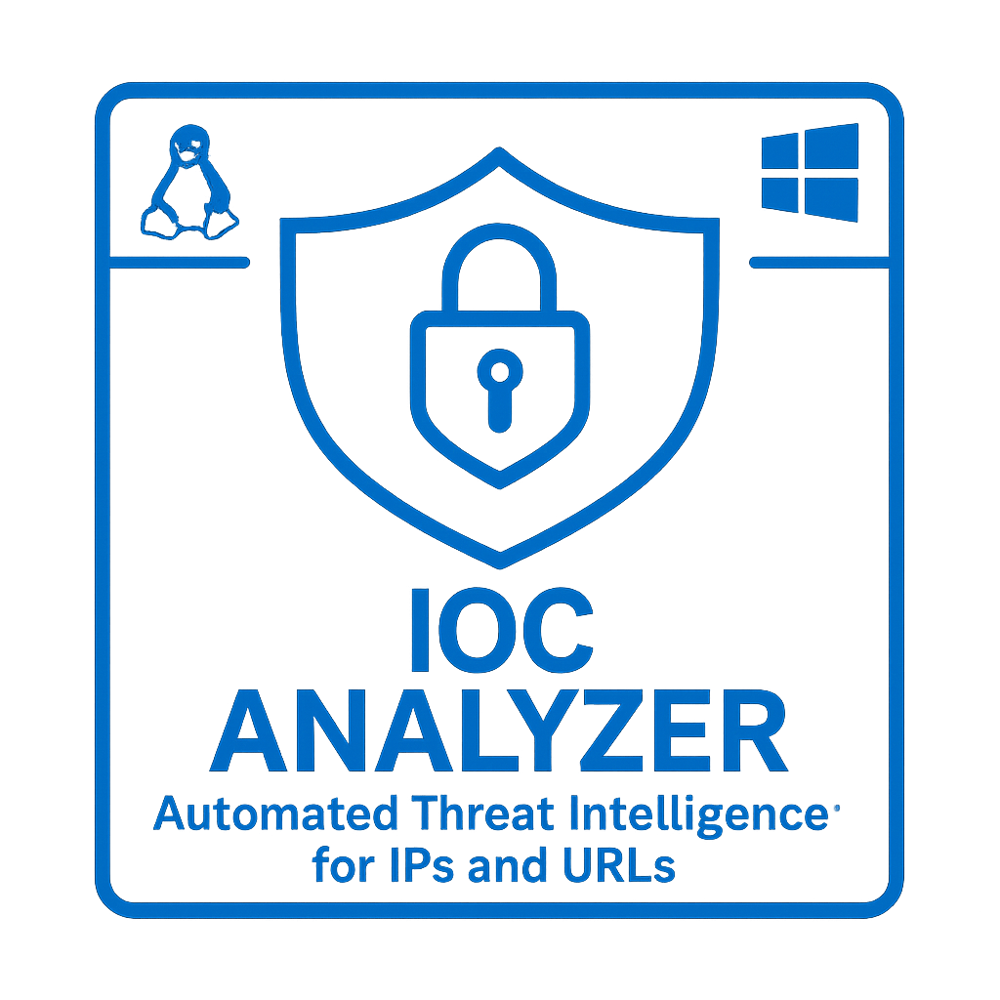
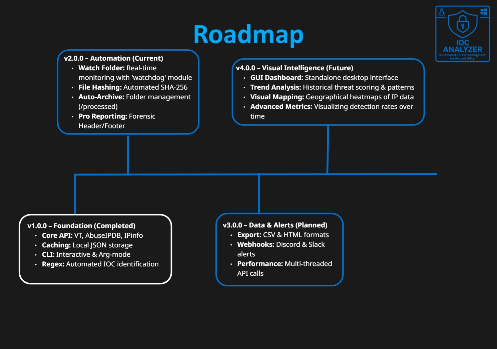
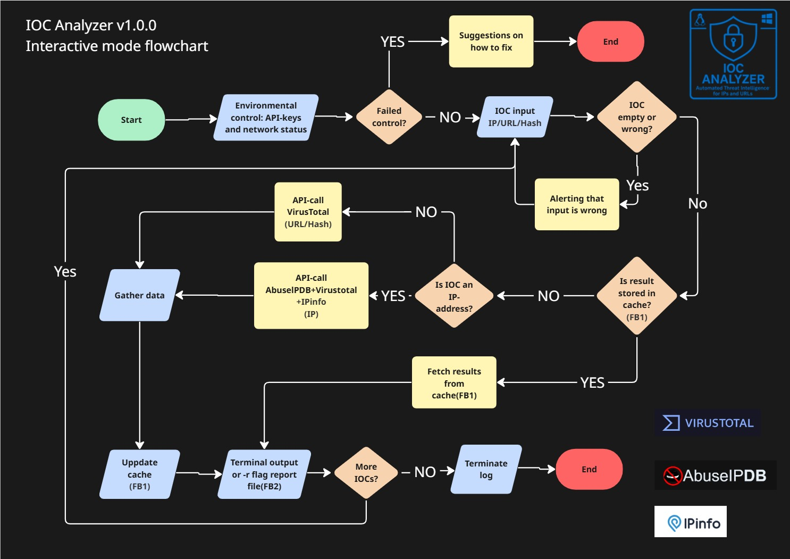
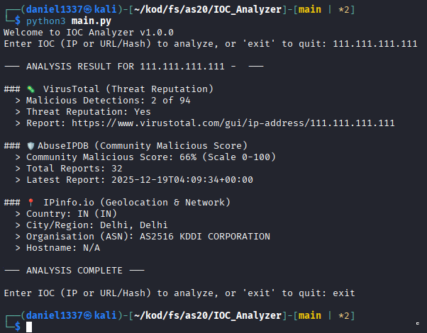
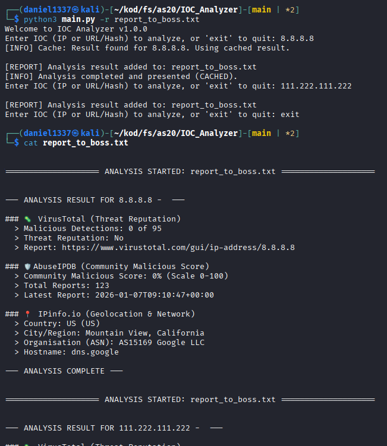
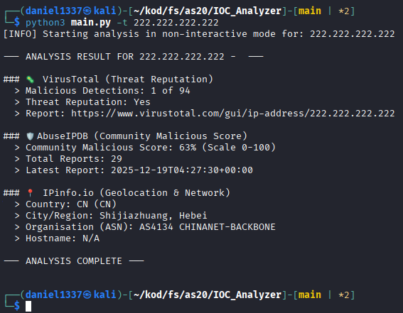
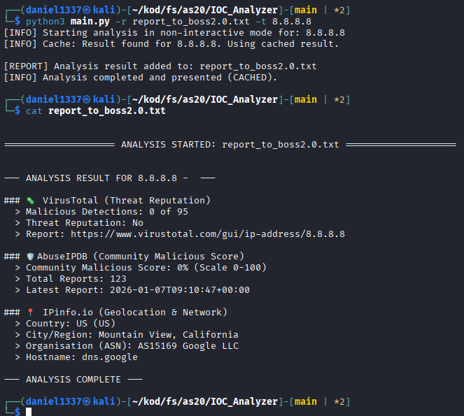
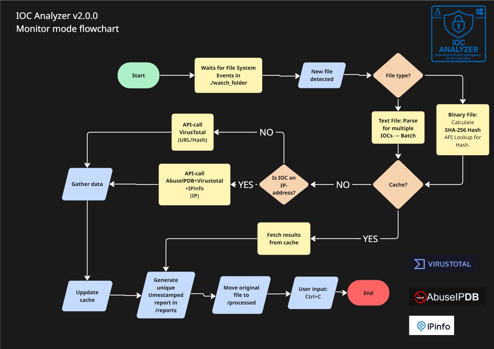
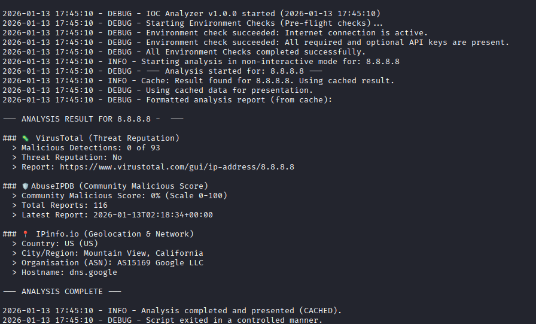

<div align="center">
    
</div>

# IOC Analyzer


**Version:** 2.0.0

**Developer:** Daniel Hållbro (Student)

IOC Analyzer 2.0 is a powerful Threat Intelligence framework designed to automate the triage of Indicators of Compromise (IOCs). By leveraging high-performance API integrations with VirusTotal, AbuseIPDB, and IPinfo, the tool provides a rapid, multi-source security overview of IPs, URLs, and hashes.

Now featuring an Automated Watch Folder for instant, hands-free analysis and SHA-256 hashing of binary files.

---

## Table of Contents

* [IOC Analyzer](#ioc-analyzer)
* [What's New](#whats-new-in-v200)
* [Features](#features)
* [Roadmap](#roadmap)
* [Requirements](#requirements)
* [Configuration](#configuration)
* [API Key Acquisition](#api-key-acquisition)
* [Usage](#usage)
* [Project Structure](#project-structure)
* [Security Note](#security-note)
* [Contributing](#contributing)

---

## What's New in v2.0.0

**Automated Watch Folder:** Monitor a specific directory in real-time. Drop a file, and get an instant analysis report without touching the terminal.

**Binary File Hashing:** Support for malicious file analysis. The tool automatically calculates SHA-256 hashes for binary files (PE, ELF, PDF, etc.) for reputation lookups.

**Intelligent File Handling:** Automatic sorting of analyzed files into a processed/ folder to maintain a clean workspace.

**Enhanced Automated Reporting:** When using **Monitor Mode**, every detected file triggers a unique, timestamped report with professional headers and footers for better traceability.

**Maintaining Platform Independence:** Fully compatible with Linux, macOS, and Windows with automated directory management.

---

## Features

* **Multisource Analysis:** Integrates data from VirusTotal, AbuseIPDB, and IPinfo.
* **IP Analysis:** Retrieves threat reputation, Abuse Score, and geolocation/ASN data.
* **URL/Hash Analysis:** URL/Hash Analysis: Uses VirusTotal for threat reputation. V2.0.0 now includes automatic SHA-256 hashing for binary files in monitor mode.
* **Caching:** Caches results (default 1 day) to avoid unnecessary API calls and conserve quotas.
* **Operating Modes:** Three flexible operating modes - interactive mode, non-interactive CLI mode and monitoring mode **(NEW!)**.
* **Reporting:** Ability to output analysis results to a dedicated report file.
* **Logger:** Features a multi-level logger that records all script activities into a persistent log file with precise timestamps.
* **Multiple platform usage:** Can be run on Linux, Windows and macOS systems.

<small>[To the top](#ioc-analyzer)</small>
---

## Roadmap



<small>[To the top](#ioc-analyzer)</small>
---

## Requirements

* Python 3.x
* The libraries specified in `requirements.txt`: `requests`, `python-dotenv`, `watchdog`.
* Writing privelages in project directories.

### Installation (Recommended Method)

The standard and most reliable way to install the required dependencies is by using a virtual environment and `pip`.

#### 1. Project Setup

1.  **Clone or Download the Project:**
    ```bash
    git clone [Your Git URL Here]
    cd IOC_Analyzer
    ```

2.  **OPTIONAL: Set up a Virtual Environment:**
    (A virtual environment (`venv`) is highly recommended to keep the project's dependencies isolated from your system's main Python installation.)

    |       OS        | Command to Create Virtual Environment |    Command to Activate     |
    | --------------- |  -----------------------------------  |  ------------------------  |
    | **Linux/macOS** |        `python3 -m venv venv`         | `source venv/bin/activate` |
    |   **Windows**   |        `python -m venv venv`          | `.\venv\Scripts\activate`  |

3.  **Install Dependencies:**
    With the virtual environment activated, use `pip` to install the packages from the provided `requirements.txt` file:

    ```bash
    pip install -r requirements.txt
    ```

<small>[To the top](#ioc-analyzer)</small>
---

## Configuration

The tool requires API keys (tokens) to operate. These should be stored in a separate environment file (`.env`) for security.

1.  **Create the `.env` File:**
    Create a file named **`.env`** in the root directory of the project (IOC_Analyzer/ by default).

2.  **Add API Keys:**
    **VirusTotal (VT\_API\_KEY) is mandatory**. The others are optional but recommended for full analysis.

    ```bash
    # CRITICAL REQUIREMENT. Key should be inserted within the quotations ''
    VT_API_KEY='your_virustotal_api_key'

    # OPTIONAL APIs. Key should be inserted within the quotations ''
    ABUSE_API_KEY='your_abuseipdb_api_key'
    IPINFO_API_KEY='your_ipinfo_api_key'
    ```

<small>[To the top](#ioc-analyzer)</small>
---

## API Key Acquisition

This tool requires API keys from the following three services to function correctly. All services offer a free/community tier suitable for typical usage.

### 1. VirusTotal (VT)

* **Service:** Provides reputation scores and detailed context for file hashes, domains, IPs, and URLs.
* **Acquisition:**
    1.  Create an account on the official VirusTotal website. **https://virustotal.com**
    2.  Navigate to **API Key** option in the dropdown menu (top right corner of your browser).
    3.  Locate and copy your **API Key**.

### 2. AbuseIPDB

* **Service:** Used to report and check the abuse confidence score for public IP addresses.
* **Acquisition:**
    1.  Register an account on the AbuseIPDB website. **https://abuseipdb.com**
    2.  Go to the **API** section in your dashboard.
    3.  Generate and copy your personal **API Key**.

### 3. IPinfo

* **Service:** Provides geolocation, hosting provider, and other critical metadata for IP addresses.
* **Acquisition:**
    1.  Sign up for an account on the IPinfo website. **https://ipinfo.io**
    2.  Access your **Dashboard** or **Account** settings.
    3.  Copy the **Access Token** (which serves as your API Key).


Once you have acquired these three keys, place them in the appropriate environment variables in your **`.env`** file, as detailed in the **Configuration** section.

### Developer Resources
If you want to explore the API documentation or develop your own logic, you can find the official resources here:

[VirusTotal API Docs](https://developers.virustotal.com/reference/main) | [AbuseIPDB API Reference](https://www.abuseipdb.com/api) | [IPinfo Developer Portal](https://ipinfo.io/developers)

<small>[To the top](#ioc-analyzer)</small>
---

## Usage

The IOC Analyzer v2.0.0 provides three distinct ways to handle threat intelligence, catering to different workflows.

### 1. Interactive Mode (Default)
Ideal for manual, one-off lookups. Simply run the script, and it will prompt you for input.

```bash
python3 main.py

# Save the output to a specific report file
python3 main.py -r my_report.txt
```
---
<details>
  <summary> View Interactive Mode Logic Flowchart (Dropdown)</summary>
  <br>
  
</details>

---

#### Example using Kali Linux:



#### Example when run interactively with -r flag:



### 2. CLI Mode (Non-interactive)
Best for power users or integration into other scripts. Provide a single target directly via arguments.

```bash
# Analyze a specific IP, URL, or Hash
python3 main.py -t 8.8.8.8

# Save the output to a specific report file
python3 main.py -t 8.8.8.8 -r my_report.txt
```
#### Example when run non-interactively:



#### Example when run non-interactively combined with report flag (cached result):



---

### 3. Monitor Mode (Automated Workflow)        **NEW!**
New in v2.0.0. This mode turns the tool into an automated analysis station. It watches a specific folder and processes any file dropped into it.

```bash
python3 main.py -m
```

---

<details>
  <summary> View Monitor Mode Logic Flowchart (Dropdown)</summary>
  <br>
  
</details>

---

**Target:** 
* Watches the ./watch_folder directory.

**Handling:** 
* .txt files are parsed for lists of IOCs (Batch analysis).

* Binary files are automatically hashed (SHA-256) and checked against threat databases.

* Automation: Once analyzed, the original file is moved to ./watch_folder/processed/ and a unique, timestamped report is generated in ./watch_folder/reports/.

---

### 4. Real-time Logging Monitoring
The script maintains a comprehensive log of all actions. This is useful for debugging, auditing, or real-time monitoring of the analysis process.

#### Monitoring logs (Linux/macOS):
Open a separate terminal in the project root directory and run:
```bash
tail -f ioc_analyzer.log
```

#### Monitoring logs (Windows PowerShell):
Open a separate terminal in the project root directory and run:
```powershell
Get-Content ioc_analyzer.log -Wait
```



---

### 5. Test run of v1.0.0 @youtube

<a href="https://www.youtube.com/watch?v=BN5-2iMqi4c">
  
</a>

<small>[To the top](#ioc-analyzer)</small>
---

## Project Structure

#### To clearly illustrate where files are located, the project follows this structure:

```markdown
IOC_Analyzer/
├── main.py             <-- Application Entry Point.
├── requirements.txt    <-- Required libraries.
├── .env                <-- dotenv-file containing API-keys.
├── ioc_analyzer.log    <-- Log file created here upon first use of script.
├── ioc_cache.json      <-- Cache file created and maintained here upon use of script.
├── <Report_File>       <-- Report file created and appended here upon use of -r flag.
└── modules/
|   ├── virustotal.py:  Handles API communication and data retrieval from VirusTotal.
|   ├── abuseipdb.py:   Handles API communication and data retrieval from AbuseIPDB.
|   ├── ipinfo.py:      Handles API communication and data retrieval from IPinfo.
|   ├── cache.py:       Manages the local caching of results in `ioc_cache.json`.
|   ├── formatter.py:   Responsible for taking raw results and formatting them into readable output.
|   ├── pre_checks.py:  Handles initial validation (e.g., checking API keys and IOC type).
|   ├── reporter.py:    Handles writing analysis output to the log file (`ioc_analyzer.log`) or a specified report file.
|   ├── logger.py:      Configures and manages the Python logging module, consistently written to the `ioc_analyzer.log` file.
|   ├── monitor.py:     The heart of Version 2.0, utilizing the `watchdog` library. Uses an observer pattern to watch for file system events and triggers automated workflows. **NEW!**
|   └── utils.py:       Contains utility functions used across multiple modules, primarily for input validation and classification.
└── watch_folder/       The automated "drop zone" for analysis. **NEW!**
    ├── processed/      Archive for files that have been successfully analyzed. **NEW!**
    └── reports/        Destination for individual, timestamped analysis reports generated in monitor mode. **NEW!**
```

<small>[To the top](#ioc-analyzer)</small>
---

## Security Note

* **API Keys:** Ensure your `.env` file containing API keys is never committed or pushed to a public repository. It is included in the `.gitignore` file for your safety.
* **IOCs:** Exercise caution when submitting active Indicators of Compromise (URLs, IPs) to external services.

<small>[To the top](#ioc-analyzer)</small>
---

## Contributing

I gladly welcome contributions and ideas! If you have suggestions or want to report a bug, please follow these steps:

1.  Fork the repository.
2.  Create a new feature branch (`git checkout -b feature/AmazingFeature`).
3.  Commit your changes (`git commit -m 'Add some AmazingFeature'`).
4.  Push to the branch (`git push origin feature/AmazingFeature`).
5.  Open a Pull Request.

<small>[To the top](#ioc-analyzer)</small>
---
